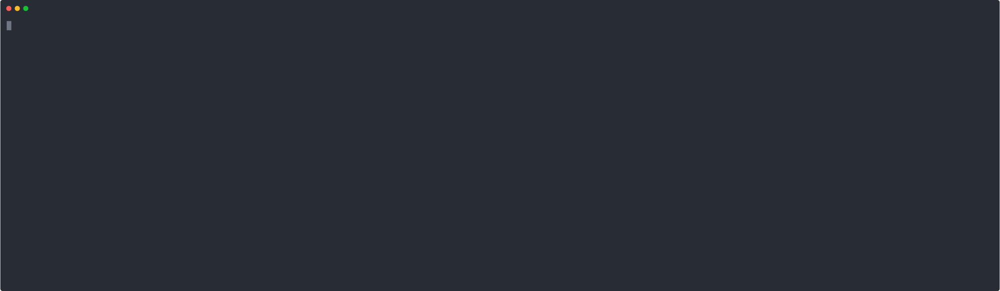

# Magic

[](https://php.net)
[](LICENSE)


Magic is a lightweight PHP/Laravel toolkit that **auto-generates application files from entity configurations** stored in [JSON files](stubs/samples/inventory.json).

It streamlines tasks like database migrations, seeding, and realistic data generation with Faker — making it ideal for testing, prototyping, and automation.

With Magic, you can build full-featured Laravel applications directly from configuration files, eliminating repetitive boilerplate and speeding up development.


Watch on YouTube:

[](https://youtu.be/8DZjpWIrGAE)
---

## 🔧 How it works



---

## 🚀 Quick Start

1. **Create a new Laravel project** (if you don’t have one yet):

   ```bash
   laravel new my-magic-app
   ```

   When prompted:
    - Choose **Vue** starter.
    - Choose **Laravel’s built-in authentication**.
    - Choose **Pest** for testing.
    - Allow Laravel to install the required packages.

2. **Navigate into your project**:

   ```bash
   cd my-magic-app
   ```

3. **Install Magic via Composer**:

   ```bash
   composer require glugox/magic --dev
   ```

4. **Publish the configuration file**:

   ```bash
   php artisan vendor:publish --provider="Glugox\Magic\MagicServiceProvider"
   ```

5. **Build your app** using a starter:

   ```bash
   php artisan magic:build --starter=inventory
   ```

6. **Or use your own config file**:

   ```bash
   php artisan magic:build --config=path/to/your/config.json
   ```

   👉 See the [sample configurations](./stubs/samples) directory for examples.

7. **Run the app**:

   ```bash
   npm run dev
   php artisan serve
   ```

---

## ✨ Overview

Magic is a Laravel-friendly toolkit that turns JSON entity definitions into a working application by scaffolding migrations, models, controllers, Vue pages, seeders, and more with a single Artisan command.

How the package plugs into Laravel
Glugox\Magic\MagicServiceProvider registers the package’s configuration file, Artisan commands, singletons such as the code and type helpers, and a custom logging channel so that the generators can log progress while they run.

The published configuration (config/magic.php) defines default paths for generated TypeScript files, Faker mappings, model presets, logging behavior, and development helpers like default passwords and “unsecure mode.”

Composer metadata exposes the provider/facade automatically and wires in helper autoloaders and development scripts for linting and tests.

Command-line workflow and build pipeline
magic:build (BuildAppCommand) is the primary entry point; it accepts a config path, starter alias, and inline overrides, then hands control to the action pipeline after blocking on any stale manifest file to prevent accidental overwrites.

GenerateAppAction orchestrates the generation workflow: it resolves the configuration, then sequentially publishes files, installs dependencies, scaffolds enums/models/migrations/controllers/Vue pages/tests, updates the database, writes a manifest, and optionally prepares the dev environment. Each step is implemented as its own action, making the pipeline extensible and easy to follow.

Configuration modeling
ResolveAppConfigAction loads configuration either from a user-specified file or a packaged starter under stubs/samples, then applies inline overrides before returning a typed Config instance.

Config turns raw JSON into typed App and Entity objects, validates the result, and offers helpers for applying overrides and fetching values. It keeps the schema reader and validator pluggable, so future formats (e.g., GraphQL SDL) can be supported.

The shared BuildContext stores the resolved config, tracks generated/updated/deleted artifacts, and can persist a manifest for future resets, ensuring generators stay idempotent.

## Code generation assets and helpers
Stub templates live under stubs/; helpers such as StubHelper load and fill them with entity-specific data, generate Pest form interactions, and build relationship metadata strings.

Front-end scaffolding leans on Support\Frontend\TsHelper to emit import blocks, table column definitions, and relation metadata from the entity model, while TypeHelper converts Laravel migration and relation types into sensible TypeScript shapes and default values.

FilesGenerationUpdate collects created/updated/deleted files and can write or replay the manifest so resets cleanly remove generated assets.

Validation, logging, and utilities
ValidationHelper composes CRUD-specific rule sets per field using the entity metadata so generated controllers/tests share a consistent validation story.

Testing and developer tooling
The test suite is built with Pest on top of Orchestra Testbench; Glugox\Magic\Tests\TestCase rewires the Laravel base path into a temp directory so generators can run without polluting your real project, and shared fixtures in tests/Pest.php provide sample configurations for feature tests.

Composer scripts make it easy to run vendor/bin/pest, Pint, PHPStan, and Rector when iterating on the package.

## Suggested next steps for newcomers
Run through the quick-start guide in the README to see a full build from the inventory starter, then inspect the manifest and generated files in a scratch Laravel project.

Study a sample config (e.g., stubs/samples/inventory.json) alongside Config/Entity classes to understand how fields, relations, and presets translate into runtime objects.

Trace individual actions in src/Actions/Build to learn how each artifact (migrations, Vue pages, tests) is produced; start with GenerateMigrationsAction or GenerateVuePagesAction and their stub usage.

Experiment with overrides and validation by editing the Faker mappings or model presets in config/magic.php, then observe how ValidationHelper and TypeHelper adjust generated rules and UI scaffolding.

Run the Pest suite and read the feature tests to see example assertions for generated code; they’re a good reference when adding new generators or adjusting stubs.

With these pieces in mind, you’ll be well-prepared to extend Magic—whether that means adding new generator actions, tweaking the schema model, or customizing the stubs for your team’s conventions.

---

## 📦 Starter Kits

Use predefined configurations to bootstrap your app:

- Task Management
- E-commerce
- Education
- Resume Builder

**How to use:**

1. Pick a starter from the [samples](./stubs/samples) directory (use file name as starter name).
2. Run:

   ```bash
   php artisan magic:build --starter=task
   ```

---

## 🤝 Contributing / Contact

Got ideas or feedback?  
Reach out via [email](mailto:ervinbeciragic@gmail.com).

---

## 📄 License

The MIT License (MIT). See [LICENSE](LICENSE.md) for details.


composer require glugox/magic:@dev --prefer-source --repository='{"type":"path","url":"/Users/ervin/Code/github.com/glugox/magic"}'
